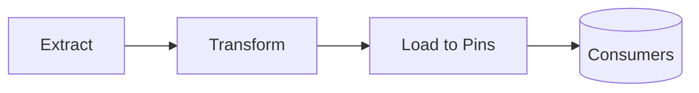
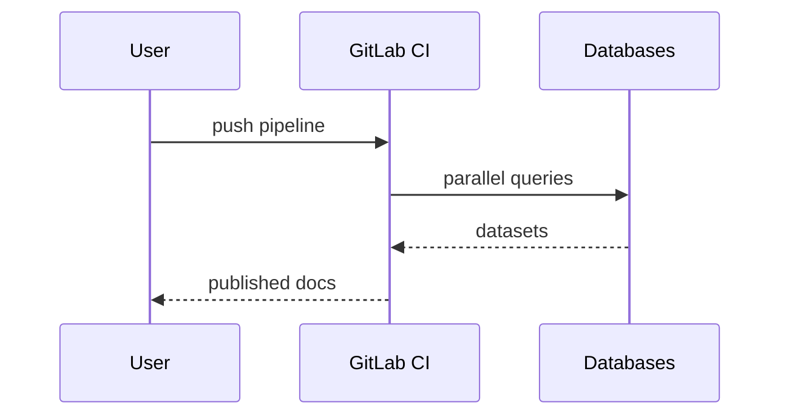
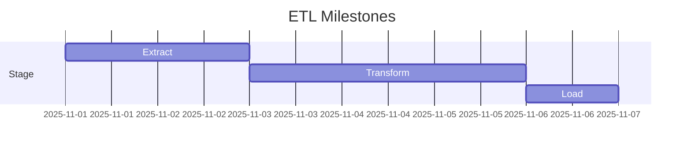

# Mermaid Diagrams

> Theme automatically follows the site’s light/dark setting.

```mermaid
flowchart LR
  A[Extract] --> B[Transform]
  B --> C[Load to Pins]
  C --> D[(Consumers)]
```

```mermaid
sequenceDiagram
  participant U as User
  participant CI as GitLab CI
  participant DB as Databases
  U->>CI: push pipeline
  CI->>DB: parallel queries
  DB-->>CI: datasets
  CI-->>U: published docs
```

```mermaid
gantt
  dateFormat  YYYY-MM-DD
  title ETL Milestones
  section Stage
  Extract   :a1, 2025-11-01, 2d
  Transform :a2, after a1, 3d
  Load      :a3, after a2, 1d
```
